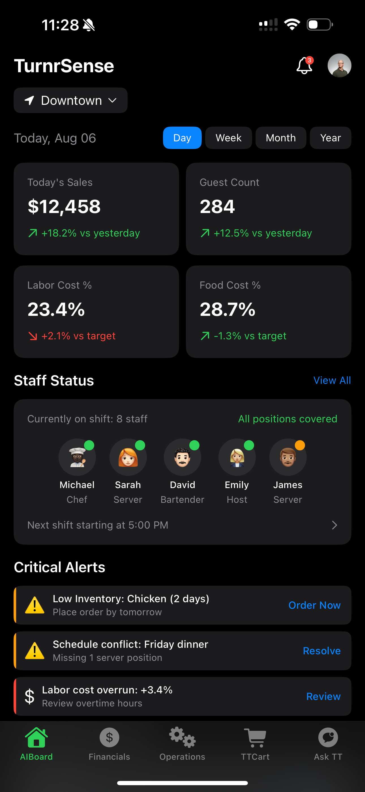

# iOS App Demo Images Fix

## Issue
The Turnr images (TurnrSense, TurnrAgent, TurnrSupply, TurnrTally) are not showing up in the deployed website's iOS App Demo section.

## Root Cause
The images were added to the `landing-page-blog-addition` branch but may not have been properly included in the deployment or there was a case sensitivity issue with file extensions.

## Fix Applied
1. **Copied all Turnr images** from the `landing-page-blog-addition` branch to the `fix-ios-demo-images` branch
2. **Standardized file extensions** to lowercase `.png` for consistency
3. **Added images to git** to ensure they're included in deployment

## Images Fixed
- `TurnrSense.png` - Real-time Analytics Dashboard screenshot
- `TurnrAgent.png` - AI Assistant Interface screenshot
- `TurnrSupply.png` - Inventory Management screenshot
- `TurnrTally.png` - Financial Tracking screenshot
- `TableTurnr_Logo.png` - Updated brand logo

## File Paths
All images should be referenced directly from the root directory:
```html



```

## Expected Behavior After Fix
- iOS App Demo section should display all 4 app screenshots properly
- Images should load without 404 errors
- Slideshow animation should work with all images visible
- Phone mockups should contain the actual app screenshots

## Testing
After deployment, verify:
1. All 4 Turnr images load properly in the iOS App Demo section
2. No 404 errors in browser console for image assets
3. Slideshow transitions work smoothly between all screenshots
4. Images display at correct size within phone mockups